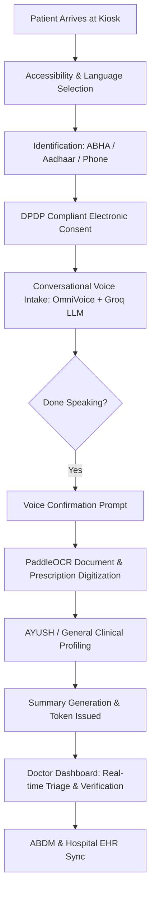

# Product Requirements Document (PRD)
## Project: AyuMitra — AI-Powered Smart Clinical Intake & Decision Support System

---

## 1. Executive Summary & Problem Statement

### 1.1 Context
In Indian public and private hospitals, outpatient departments (OPDs) face heavy patient loads, leading to severe doctor burnout and long wait times (often exceeding 2–4 hours for a 2-minute consultation). Paper-based prescriptions, fragmented medical records, and language barriers in diverse linguistic regions further degrade healthcare delivery.

### 1.2 Problem Statement
Design an intelligent, accessible, multilingual patient case-taking and clinical decision-support kiosk system that empowers patients to self-record symptoms via conversational voice/touch, automatically digitizes past physical prescriptions and lab reports, extracts clinical entities (SNOMED CT, ICD-10, AYUSH), identifies emergency red flags, and prepares verified, ABDM-compliant clinical summaries for attending physicians.

---

## 2. Target Personas & Stakeholders

| Persona | Description | Key Needs |
|---|---|---|
| **OPD Patient (Rural / Low-Literacy)** | Seeks healthcare at public hospitals with language and digital barriers. | Voice-first conversational intake in native language, elderly/low-literacy visual cues, no complex typing. |
| **OPD Patient (Digital / Tech-Savvy)** | Has smartphone, ABHA address, past digital records. | Instant ABHA ID login, high-speed document OCR upload, transparent summary review. |
| **Attending Physician / Doctor** | Handles 60–100 patients per OPD shift with limited time per consultation. | Pre-structured SOAP consultation notes, instant red-flag alerts, dual Allopathic + AYUSH insights, one-click ABDM sync. |
| **Hospital Administrator / CMO** | Manages hospital patient queue, throughput, and regulatory compliance. | Reduced OPD bottlenecks, DPDP Act 2023 compliant consent tracking, immutable audit trails. |

---

## 3. Core User Journeys

### 3.1 Patient Intake Journey
1. **Welcome & Language Preference**: Select preferred Indian language (Hindi, English, Tamil, Telugu, Kannada, Marathi, Bengali) and accessibility mode (Standard, Elderly, Low-Literacy).
2. **Identity & Demographics**: Register or authenticate using ABHA Number/Address, Aadhaar, Hospital MRN, or Phone.
3. **Electronic Consent**: Granular consent for clinical history, document scanning, and physician sharing under DPDP Act 2023.
4. **OmniVoice Conversational Intake**: Empathetic AI voice dialogue collects symptoms, onset, severity, and timeline in patient's native dialect.
5. **Direct OCR Landing**: On concluding voice complaints, user confirms and immediately lands on the document scanning screen.
6. **Medical Document Digitization**: Scans physical prescriptions and lab reports with instant OCR parsing into structured medications and test results.
7. **Doctor Preference & AYUSH Profiling**: Captures Dosha balance (Prakriti, Agni, Koshtha) and medical history.
8. **Token Issuance & Queue Placement**: Patient receives OPD queue token and summary confirmation.

### 3.2 Doctor Review Journey
1. **Live Queue & Triage Dashboard**: Active list of patients sorted by arrival time and clinical severity (CRITICAL vs. ROUTINE).
2. **Red-Flag Emergency Notifications**: High-visibility banners for acute coronary syndromes, stroke signs, or severe respiratory distress.
3. **AI Clinical Summary Review**: Pre-structured SOAP note with confidence indicators and side-by-side OCR entity inspector.
4. **Physician Verification & Sign-off**: Doctor modifies, adds physician notes, signs off, and triggers one-click ABDM / HIS dispatch.

---

## 4. Functional Requirements (FR)

### FR-1: Multilingual Voice & Speech Dialogue
* **FR-1.1**: Continuous real-time voice speech recognition and audio synthesis supporting Hindi and English.
* **FR-1.2**: Multilingual NLP extraction of chief complaints, onset, duration, and anatomical body parts.
* **FR-1.3**: Automatic conversational intent detection for concluding complaints ("बस इतना ही", "I am done").

### FR-2: Direct OCR Landing & Document Processing
* **FR-2.1**: Automated transitional prompt post-voice intake with direct routing to OCR document scanner.
* **FR-2.2**: Camera capture and file upload for prescription images and PDF lab reports.
* **FR-2.3**: Multilingual optical character recognition (PaddleOCR) with bounding box confidence scoring.
* **FR-2.4**: Structured LLM extraction of drug names, dosages, frequency, duration, test values, and abnormal indicators.

### FR-3: Emergency Triage & Red-Flag Evaluator
* **FR-3.1**: Real-time evaluation of life-threatening symptoms (Cardiovascular, Respiratory, Sepsis, Neurological).
* **FR-3.2**: Immediate visual alert badges and automated priority queue escalation for critical patients.

### FR-4: Dual Modern & AYUSH Clinical Mapping
* **FR-4.1**: Standardized coding with SNOMED CT and ICD-10 terminologies.
* **FR-4.2**: Dedicated AYUSH assessment module capturing Prakriti (Vata/Pitta/Kapha), Agni, Koshtha, and traditional remedies.

### FR-5: Doctor Decision-Support Workstation
* **FR-5.1**: Live patient queue with arrival timestamp, triage tier, and document count.
* **FR-5.2**: Interactive SOAP summary viewer with entity confidence metrics.
* **FR-5.3**: Physician verification sign-off and electronic signature timestamping.

### FR-6: Patient Identity & ABDM Compliance
* **FR-6.1**: ABHA ID verification and demographic lookup.
* **FR-6.2**: Purpose-limited electronic consent record storage and revocability tracking.
* **FR-6.3**: Immutable audit logging for all patient record creations, views, and doctor modifications.

---

## 5. Non-Functional Requirements (NFR)

* **NFR-1 (Performance & Latency)**:
  * Voice dialogue turn response time $< 800\text{ ms}$.
  * Document OCR parsing and entity extraction completed in $< 5\text{ seconds}$.
* **NFR-2 (Security & Privacy)**:
  * Zero exposure of AI API keys or database connection strings to the client.
  * DPDP Act 2023 and HIPAA-compliant data storage with SSL/TLS encryption in transit and at rest.
  * Rate limiting, secure HTTP response headers, and sanitized error handling.
* **NFR-3 (Availability & Resilience)**:
  * 99.9% uptime target with offline-tolerant simulation fallbacks for external ABDM and HIS services.
* **NFR-4 (Accessibility)**:
  * WCAG 2.1 AA compliant UI, high-contrast toggle, elderly font scaling, and voice-assisted prompts.

---

## 6. Success Metrics & Key Performance Indicators (KPIs)

1. **OPD Consultation Time Savings**: Reduce doctor data-entry time by **$\ge 60\%$** (from ~8 mins to $<3$ mins per patient).
2. **OCR Prescription Extraction Accuracy**: $\ge 90\%$ accuracy on printed and legible handwritten medical documents.
3. **Voice Case-Taking Completion Rate**: $\ge 85\%$ of self-service kiosk sessions completed without operator intervention.
4. **Emergency Detection Speed**: Real-time triage alert generated within **$< 1\text{ second}$** of symptom utterance.
