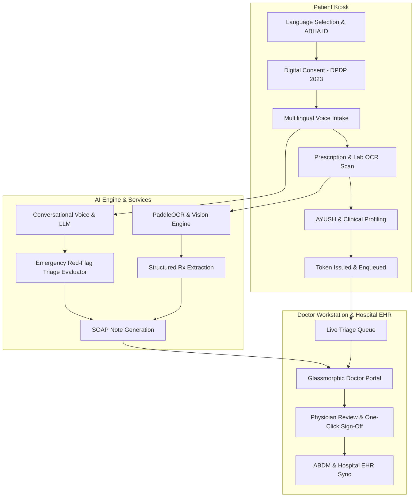

# 🌿 AyuMitra (आयुमित्र)
### AI-Powered Multilingual Patient Intake & Doctor Decision Support Workstation

[](https://reactjs.org/)
[](https://www.typescriptlang.org/)
[](https://vitejs.dev/)
[](https://tailwindcss.com/)
[](https://expressjs.com/)
[](https://abdm.gov.in/)
[](https://www.meity.gov.in/)

---

## 📌 Overview

In Indian Outpatient Departments (OPDs), doctors routinely attend to **60 to 100+ patients in a single shift**, leaving barely **2–3 minutes per consultation**. Much of this precious time is consumed by repetitive demographic recording, deciphering handwritten historical prescriptions, manual typing, and overcoming dialect barriers.

**AyuMitra** transforms public and private hospital OPDs with a dual-sided digital healthcare ecosystem:
1. **Patient Self-Service Kiosk**: An intuitive, voice-first, touch-friendly kiosk guiding patients through registration, multilingual clinical intake, and prescription digitization.
2. **Doctor Clinical Decision Workstation**: A modern glassmorphic dashboard delivering instant pre-structured SOAP notes, automated emergency red-flag triage, and AYUSH/Allopathic integration.

---

## ✨ Key Features

### 🎙️ 1. Multilingual Voice-First Intake
* Natural conversational voice intake supporting **Hindi, English, and Indian regional languages**.
* Real-time entity extraction: automatically captures chief complaints, onset duration, symptom severity, and anatomical locations.
* Voice confirmation and interactive multi-choice question prompts for patients with varying digital literacy.

### 📄 2. AI Document & Prescription Digitization (OCR)
* Direct landing on document capture post-voice intake for paper prescriptions, lab reports, and discharge summaries.
* Multilingual **PaddleOCR** extraction with bounding-box confidence metrics.
* LLM-driven structured extraction of drug names, dosages, frequencies, treatment duration, and diagnostic test values.

### 🚨 3. Emergency Red-Flag Triage & Evaluator
* Real-time rule and AI evaluator for acute, life-threatening symptoms (Cardiovascular, Respiratory, Sepsis, Neurological).
* Instant high-visibility visual badges and automatic priority escalation in the doctor's live queue.

### 🌿 4. Dual Modern & AYUSH Clinical Profiling
* Standardized medical codification using **SNOMED CT** and **ICD-10**.
* Dedicated AYUSH clinical module capturing **Prakriti** (*Vata, Pitta, Kapha*), **Agni**, **Koshtha**, and traditional remedies.

### 🩺 5. Doctor Clinical Decision Workstation
* Live patient queue sorted by arrival time and emergency triage tier.
* One-click verification and editing of AI-generated SOAP notes (*Subjective, Objective, Assessment, Plan*).
* Digital signature verification and instant record finalization.

### 🔒 6. ABDM & DPDP Act 2023 Compliance
* **ABHA ID** identification, demographic verification, and token issuance.
* Granular purpose-specific digital consent capture with revocation capability.
* Tamper-evident audit logging for all patient data access and modifications.

---

## 🏗️ System Architecture



---

## 🛠️ Technology Stack

| Layer | Technologies |
|---|---|
| **Frontend** | React 19, TypeScript, Vite, TailwindCSS v4, Lucide Icons, Motion (Framer Motion) |
| **Backend** | Node.js, Express, TSX, REST APIs |
| **Database & ORM** | PostgreSQL, Prisma ORM |
| **AI & LLM Services** | Google Gemini API (`@google/genai`), Multilingual NLP |
| **OCR & Vision** | PaddleOCR Python microservice, PDF/Image parsers |
| **Voice Processing** | Web Speech API / OmniVoice Speech Synthesis & Recognition |
| **Compliance & Standards** | ABDM (ABHA), SNOMED CT, ICD-10, NAMASTE (AYUSH), DPDP Act 2023 |

---

## 📂 Project Structure

```
AyuMitra/
├── src/
│   ├── components/
│   │   ├── doctor/                # Doctor Workstation UI
│   │   │   ├── DoctorDashboard.tsx
│   │   │   ├── DoctorLoginScreen.tsx
│   │   │   ├── LiveQueue.tsx
│   │   │   ├── PatientDetailModal.tsx
│   │   │   └── SoapNoteViewer.tsx
│   │   ├── patient/               # Patient Kiosk Screens
│   │   │   ├── WelcomeScreen.tsx
│   │   │   ├── LanguageSelector.tsx
│   │   │   ├── IdentificationScreen.tsx
│   │   │   ├── ConsentScreen.tsx
│   │   │   ├── GeneralIntakeScreen.tsx
│   │   │   ├── DocumentScanScreen.tsx
│   │   │   ├── AyushIntakeScreen.tsx
│   │   │   ├── PatientReviewScreen.tsx
│   │   │   └── CompletionScreen.tsx
│   │   └── ui/                    # Reusable Design System Components
│   ├── data/                      # Clinical datasets & mock data
│   ├── services/                  # AI, OCR bridge & backend API callers
│   ├── types.ts                   # Unified TypeScript interfaces
│   ├── index.css                  # Global styles & glassmorphic tokens
│   └── main.tsx                   # React application root
├── ocr_service/                   # PaddleOCR Python microservice
├── voice_service/                 # Voice synthesis & recognition service
├── prisma/                        # Database schema & migrations
├── server.ts                      # Express API backend server
├── AYUMITRA_PRD_AND_TRD.md        # Detailed Product & Technical Specification
└── package.json                   # Dependencies and npm scripts
```

---

## 🚀 Getting Started

### Prerequisites
* **Node.js**: v18.0 or higher
* **npm** or **yarn** / **pnpm**
* **Gemini API Key**: [Get your API Key from Google AI](https://aistudio.google.com/)

### Installation & Setup

1. **Clone the repository**:
   ```bash
   git clone https://github.com/Mayank03-321/AyuMitra.git
   cd AyuMitra
   ```

2. **Install dependencies**:
   ```bash
   npm install
   ```

3. **Configure Environment Variables**:
   Create a `.env` file in the root directory:
   ```env
   # Gemini API Key for clinical summarization
   GEMINI_API_KEY="your_actual_gemini_api_key"

   # Server Configuration
   PORT=3000
   ```

4. **Start the Development Server**:
   ```bash
   npm run dev
   ```
   Open [http://localhost:3000](http://localhost:3000) in your browser to view the application.

5. **Build for Production**:
   ```bash
   npm run build
   npm start
   ```

---

## 🔒 Security & Regulatory Compliance

* **Data Protection**: Zero unencrypted storage of Personal Health Identifiers (PHI) in compliance with the **Digital Personal Data Protection (DPDP) Act 2023**.
* **Clinical Safety**: AI-generated notes are advisory-only; final approval requires doctor sign-off with audit logging.
* **National Standards**: Built to seamlessly map to India's **Ayushman Bharat Digital Mission (ABDM)** standards.

---

## 📄 License

This project is licensed under the [MIT License](LICENSE).
